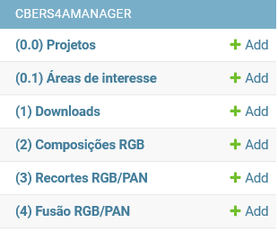
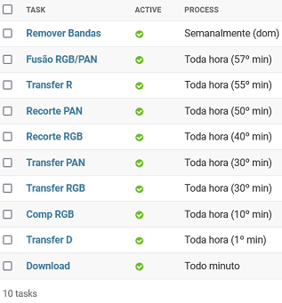

# CBERS4AManager
App para download, composição RGB, recorte, calcular coeficiente de nuvens e fazer pansharpen de imagens CBERS4A.

## Requisitos
* Docker: 
  * Windows:
    * Fazer o download e instalar [Start Docker Desktop](https://docs.docker.com/desktop/install/windows-install/ "Start Docker Desktop"); e
    * Fazer o download e instalar o [Windows Subsystem for Linux Kernel](https://wslstorestorage.blob.core.windows.net/wslblob/wsl_update_x64.msi "Windows Subsystem for Linux Kernel") (wsl2kernel)

  * Debian/Ubuntu: 
    ```
    curl -fsSL https://get.docker.com -o get-docker.sh
    DRY_RUN=1 sh ./get-docker.sh
    apt install docker-compose
    ```
## Instalação

```
git init
git pull https://github.com/HumbertoDiego/django-cbers4amanager
docker-compose up -d
docker-compose exec app python manage.py makemigrations
docker-compose exec app python manage.py migrate
docker-compose exec app python manage.py createsuperuser
docker-compose exec app python cbers4amanager/management/pop_processes.py
docker-compose restart
```
## Fluxo de tabalho

1. Navegar para a página `http://<IP>:81/admin`, realizar o LOGIN com as credenciais de superusuário criadas.
2. As tabelas estão nomeadas na ordem dos trabalhos.



3. O programa `pop_processes.py` insere o agendamento necessário nas tabelas `process` e `task`.



4. Inserir as informações do projeto. Os limites cadastrados não são utilizados nas etapas seguintes, servindo apenas para fins de visualização.
5. Inserir as áreas de interesse. Os limites cadastrados são usados para recortar as imagens RGB e PAN em processos subsequentes, de forma que a fusão resultante tenha um tamanho razoalvelmente menor.
6. Inserir as urls de download:
    * Pesquisar em [DGI INPE](http://www2.dgi.inpe.br/catalogo/explore) e baixar do carrinho os links (inpe_catalog.txt)
    * Utilizar a opção `Import TXT` para importar as URLS em lote
7. Para popular `projeto`, `areas de interesse` e `downlodas` com dados amostrais execute: 
    * `docker-compose exec app python cbers4amanager/management/amostra/pop_amostra.py`
8. Checar as tarefas sendo executadas:
    * `docker-compose exec app ps -auxw`
      * bash ./my_wrapper_script.sh
      * python manage.py runserver 0.0.0.0:81
      * python manage.py run_jobs
      * /usr/bin/python manage.py runserver 0.0.0.0:81
      * python /app/uploads/dj_process_tasks/make_download.py --todos
    * Ou abrindo a tabela `Task Instances` pelo Django-Admin
9. Após a confecção final da imagem fusionada com resolução espacial de 2m os insumos podem ser deletados para fins de poupar espaço em disco. Para isso, atualize o Status dos itens na tabela `Fusão RGB/PAN` para `Finalizado=True` isso determina a exclusão agendada dos insumos (Downloads, Composições RGB e Recortes) que originaram o arquivo fusiondao. A exclusão tem um agendamento semanal (dom 00:02) por padrão e também exclui os arquivos órfãos, ou seja, cujo nome não esteja listado na tabela `Download`.


## Administração manual pelo SHELL

1. O programa `/app/uploads/dj_process_tasks/make_download.py` é uma cópia de `/app/cbers4amanager/management/make_download.py`. Ele é executado pelo `task`: _Download a Todo minuto_.
2. Os programas agendados para execução são, em ordem:
    * make_download.py --todos
    * transfer_download2composicaorgb.py
    * make_composicaorgb.py --todos
    * transfer_composicaorgb2recorte.py
    * transfer_bandapan2recorte.py
    * make_recorte.py --todos --rgb
    * make_recorte.py --todos --pan
    * transfer_recorte2pansharp.py
    * make_pansharp.py --todos
    * rm_insumos.py
 
    Onde --todos seleciona os IDS dos elementos não finalizados para execução. Podendo ser substituídos pelo IDs desejados.

3. A qualquer momento pode-se executá-los através do terminal, por exemplo:
    * `docker-compose exec app bash`
      * **/app#** python cbers4amanager/management/make_composicaorgb.py ID1 ID2 ID3 ...


## Administração manual pelo QGIS

1. Abrir o [QGIS](https://www.qgis.org) --> Janela navegador --> PostgreSQL --> New Connection...
   * Nome: `<qualquer>`
   * Host: `ip a | grep inet # =<IP>, escolher o IP do adaptador ligado a rede (geralmente eth0)`
   * Banco de Dados : `docker-compose exec app python -c "import os;print(os.environ['POST_DB'])"`
   * Autenticação: 
      * Usuário: `docker-compose exec app python -c "import os;print(os.environ['POST_USER'])"`
      * Senha: `docker-compose exec app python -c "import os;print(os.environ['POST_PASSWORD'])"`
2. Verificação dos dados

### Adicionar feições via QGIS

Feições geoespaciais em formatos de arquivos diversos são mais facilmente incorporadas na tabela `projeto` e `inom` (Áreas de interesse) carregadas com um simples copiar e colar dentro do QGIS.

### Deletar conjunto de arquivos obsoletos usados como insumos (bandas, composição RGB/NDVI e recortes)

Após a confecção final da imagem fusionada com resolução espacial de 2m, ou ainda, após a conclusão de que a fusão seria inviável por excesso de nuvens, os insumos podem ser deletados para fins de poupar espaço em disco. Pode-se fazer isso, de duas formas:

1. Abrir o banco em `postgres://<IP>:5432` pelo **QGIS** e deletar as linhas, o programa agendado `rm_insumos.py` se encarrega de excluir os arquivos órfãos.

2. Pela plataforma web, ao se deletar a linha, os arquivos gerados naquela etapa serão excluídos no mesmo instante:
  * Ao se deletar itens da tabela `Fusão RGB/PAN`: deleta-se também o arquivos TIFF da fusão;
  * Ao se deletar itens da tabela `Recorte RGB/PAN`: deleta-se também os arquivos TIFF recortados na área de interesse;
  * Ao se deletar itens da tabela `Composição RGB`: deleta-se o arquivo TIFF da composição RGB;
  * Ao se deletar itens da tabela `Download`: deleta-se o arquivo TIFF da banda CBERS4.

ATENÇÃO, se os downloads não forem deletados, em algum momento o agendamento será executado e as imagens das etapas subseqeuntes serão recriadas.